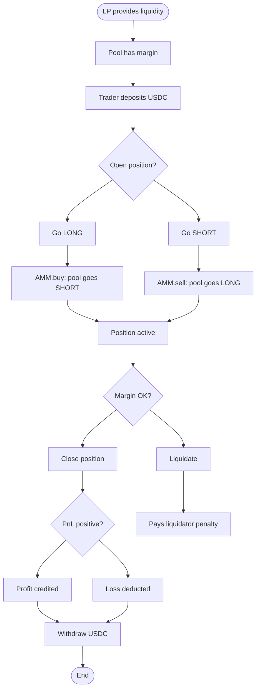
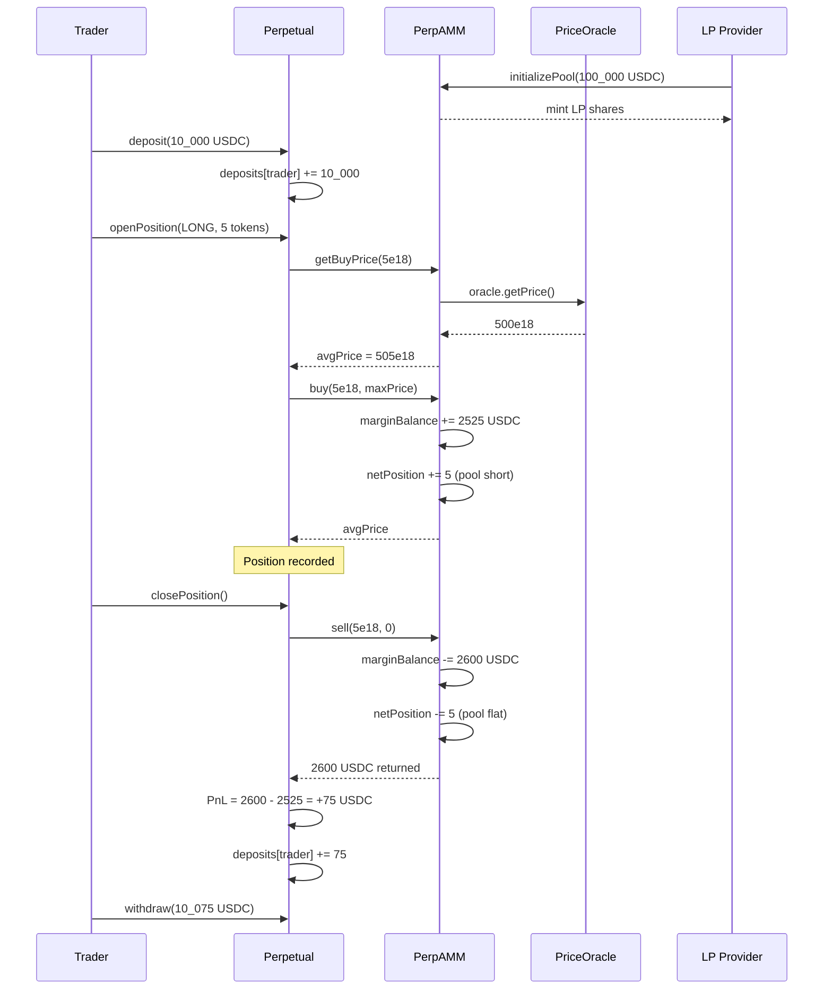
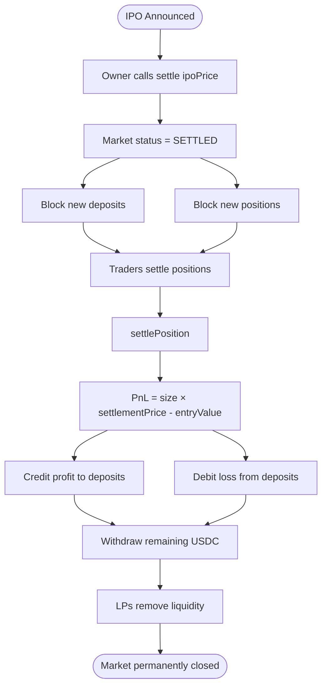

# Xray Pre-IPO Perpetual DEX — Smart Contracts

A perpetual swap DEX for pre-IPO token prices. Trade synthetic exposure to companies like OpenAI, SpaceX, and Stripe before they go public. Built with [Foundry](https://book.getfoundry.sh/).

## How It Works

### Counter-Party Model

Unlike order-book exchanges, this DEX uses an Automated Market Maker (AMM) as the counter-party to every trade:

```
Trader goes LONG  →  Pool goes SHORT  (pool sells to trader)
Trader goes SHORT →  Pool goes LONG   (pool buys from trader)
```

The pool's profit = all traders' losses. The pool's loss = all traders' traders' profits.

### Leverage

Traders only need to deposit a fraction of the position value (margin). With 10% initial margin:

```
$1,000 collateral → $10,000 notional exposure → 10x leverage
```

### Dynamic Pricing

The AMM adjusts prices based on pool utilization (net exposure):

```
Pool net short  →  Buying more increases risk  →  Higher premium
Pool net long   →  Selling more increases risk →  Higher premium for sells
```

This incentivizes trades that rebalance the pool.

---

## Trade Lifecycle



---

## System Interaction



---

## Settlement & IPO Flow



---

## Architecture

```
┌──────────────────────────────────────────────────────────┐
│                      Perpetual                           │
│  (Main entry point — deposit, trade, liquidate, settle)  │
│                                                          │
│  ┌──────────────┐  ┌──────────────┐  ┌───────────────┐  │
│  │ PriceOracle  │  │  PerpAMM     │  │ FundingCalc   │  │
│  │              │  │              │  │               │  │
│  │ • Fallback   │  │ • Counter-   │  │ • EMA premium │  │
│  │ • Chainlink  │  │   party      │  │ • Dampener    │  │
│  │ • Pyth       │  │ • Dynamic    │  │ • Settlement  │  │
│  │              │  │   pricing    │  │               │  │
│  └──────────────┘  └──────────────┘  └───────────────┘  │
│                                                          │
│  • Position tracking  • Margin checks  • Liquidations    │
│  • PnL settlement     • Token custody  • Emergency       │
└──────────────────────────────────────────────────────────┘
```

## Contracts

### PriceOracle (`src/PriceOracle.sol`)

Multi-source price oracle for pre-IPO token valuations (e.g. OpenAI at $370/share).

- **Sources**: Fallback (admin-push), Chainlink, Pyth
- **2-step commit**: `updatePrice()` → `confirmPriceUpdate()` (time-locked)
- **Emergency bypass**: owner can push instantly in crisis
- **Decimal normalization**: auto-adjusts between feed decimals (e.g. Chainlink 8dp → 18dp)

```solidity
// Bot proposes a new price (must wait UPDATE_DELAY)
oracle.updatePrice(370e18);

// After delay, confirm to apply
oracle.confirmPriceUpdate();
```

### PerpAMM (`src/PerpAMM.sol`)

Automated market maker that acts as counter-party to all trades.

- **Counter-party**: pool takes opposite side of every trade
- **Dynamic pricing**: `oraclePrice × (1 + utilization × spread)` based on pool exposure
- **Net position tracking**: positive = pool short, negative = pool long
- **LP deposits**: add/remove collateral, receive LP share tokens
- **Decimal-aware**: handles USDC (6dp) vs oracle (18dp) conversion

```solidity
// LP initializes pool with collateral
amm.initializePool(100_000e6);  // $100k USDC

// Trader opens long 10 preOPENAI (pool goes short)
uint256 avgPrice = amm.buy(10e18, type(uint256).max);
// Pool: marginBalance += 5000, netPosition += 10 (short)

// Trader opens short 5 preOPENAI (pool goes long)
amm.sell(5e18, 0);
// Pool: marginBalance -= 2500, netPosition -= 5
// Pool net: short 5 tokens
```

### Perpetual (`src/Perpetual.sol`)

Main entry point. Deploys its own AMM and coordinates all components.

- **Deposit/withdraw**: traders deposit USDC collateral
- **Trade**: open long/short via AMM (pool takes opposite side)
- **Liquidate**: anyone can liquidate undercollateralized positions
- **Emergency**: owner can pause trading
- **Settle & Close**: owner settles at IPO price, market permanently closes
- **Token custody**: holds all USDC, settles PnL internally

```solidity
// Full trade flow
perpetual.deposit(10_000e6);                    // Deposit $10k
perpetual.openPosition(Side.LONG, 5e18);         // Long 5 tokens (pool shorts)
perpetual.closePosition();                        // Close at AMM price
perpetual.withdraw(5_000e6);                      // Withdraw profits

// Settlement (after IPO)
perpetual.settle(ipoPrice);                      // Owner settles at IPO price
perpetual.settlePosition();                       // Trader exits at settlement price
perpetual.withdraw(remaining);                    // Withdraw settled funds
```

### FundingCalculator (`src/FundingCalculator.sol`)

Funding rate mechanism to tether AMM mark price to oracle spot price.

- **EMA premium**: exponential moving average of (mark − spot)
- **Dampener band**: ±0.05% where no funding is charged
- **Premium cap**: ±0.5% max funding rate
- **Settlement**: traders settle accumulated funding

### LpShareToken (`src/LpShareToken.sol`)

Standard ERC20 representing pool ownership. LPs mint shares on deposit, burn on withdrawal.

---

## Margin & Liquidation

```
Margin Ratio = (Collateral + Unrealized PnL) / Notional Value

  100% ─ ┬─ Healthy
         │
   10%  ─├─ Initial margin (required to open)
         │
    5%  ─├─ Maintenance margin (minimum to keep open)
         │
    0%  ─└─ Liquidatable (anyone can liquidate, receives 0.5% penalty)
```

---

## Key Parameters

| Parameter | Value | Description |
|-----------|-------|-------------|
| Initial Margin | 10% | Required to open a position (max 10x leverage) |
| Maintenance Margin | 5% | Minimum to avoid liquidation |
| Liquidation Penalty | 0.5% | Paid to liquidator |
| Funding Period | 8 hours | Funding rate calculation window |
| EMA Half-life | ~20 min | Premium smoothing |
| Funding Dampener | 0.05% | No-funding band |
| Premium Limit | 0.5% | Max funding rate |
| Update Delay | 5 min | Min time between price updates |
| Staleness | 1 hour | Oracle price expiry |

---

## Testing

```bash
# All tests
forge test

# Specific suite
forge test --match-path test/Integration.t.sol

# Verbose
forge test -vvvv

# Gas report
forge test --gas-report
```

**83 tests passing** across 7 suites: unit tests for each contract + full multi-contract integration tests.

---

## Development

```bash
# Build
forge build

# Test
forge test

# Format
forge fmt

# Coverage
forge coverage
```

---

## Design Notes

- **No upgradeable proxies**: immutable contracts for trust minimization
- **No governance token**: owner-controlled for testnet, can be renounced
- **Decimal-agnostic**: works with any collateral decimals (USDC 6dp, DAI 18dp, etc.)
- **Counter-party AMM**: pool takes opposite side of every trade
- **Oracle-agnostic**: supports admin-push, Chainlink, or Pyth feeds
